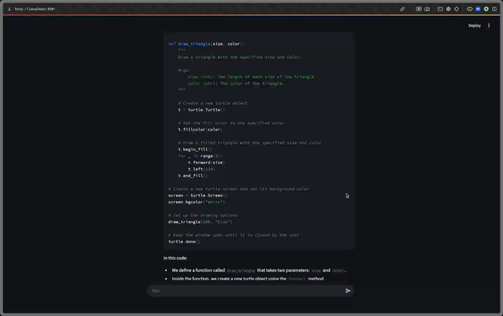

# Local AI Chatbot

This project implements a simple AI chatbot using Streamlit and Langchain with Ollama.

## Video Demo
Click to watch demo video
[](https://supercut.video/embed/devdee/f9lpIhq5eKxo9cpjjSK2Te?embed=full)


## Features

- Interactive chat interface using Streamlit
- Integration with Ollama for AI-powered responses
- Conversation history management

## Requirements

- Python 3.7+
- Streamlit
- Langchain Ollama

## Installation

1. Clone the repository
2. Install dependencies:
   ```
   pip install streamlit langchain-community
   # or alternatively:
   # uv sync 
   ```

## Usage

Run the Streamlit app:

```
streamlit run src/1_chatbot.py
```

Navigate to the provided local URL to interact with the chatbot.

## How it works

The app uses Streamlit for the user interface and Langchain Ollama to generate AI responses. The conversation history is maintained and displayed in the chat interface.

## Contributing

Contributions are welcome! Please feel free to submit a Pull Request.

